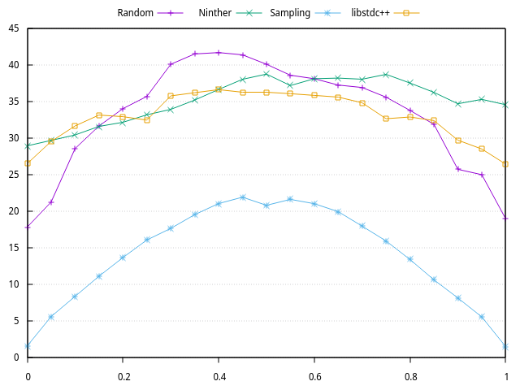

# An Efficient Sample-based Pivot Selection Strategy for Quickselect
This project implements a new sample-based pivot strategy for quickselect that outperforms many commonly used pivot
selection strategies. A benchmark tool that can measure and compare the performance of various pivot strategies is
also provided.

(A poster that outlines the algorithm is available [here](https://ldm2468.com/papers/2022sample_pivot_poster.pdf).)

## Build Instructions
The following commands generates build files and builds the benchmark tool.
```bash
cmake .
make
```

The compiled tool can be run with `./selection_benchmark`.

## Usage
The benchmark tool outputs statistics to stdout in the csv format.

The following is an overview of accepted command line arguments.
```
Usage: ./selection_benchmark [-n size] [-t type] [options]... 
    -n: Size of array (default: 1000000)
    -t: Type of array (ascending/shuffled/uniform/rotated/nearly_sorted, default: shuffled)
        The type name may also be shortened to its first character (a/s/r)
    -m: A non-zero integer that affects the array in different ways depending on the type
        ascending/shuffled: the stride of the ascending (or shuffled) array (default: 1)
        random: the range of the random numbers in the array (default: n)
    -r: Number of times to repeat each run (default: 10)
    -p: What data to print. (a: all, t: times only, c: calls only, r: ratios only)
    -k: The order of the element to find.
        If not specified, a range of values are uniformly selected from 0 to n - 1.
    -i: The number of iterations (number of columns output, default: 51)
    -a: A binary mask of algorithms to run. (ex. 100101)
```
The option `-p t` (print times only) must be set to generate data that can be plotted with
the included gnuplot scripts (`*.gp`).

The following is a list of algorithms specifiable with the `-a` mask.
```
000001: random - A popular pivot strategy that chooses a random element as the pivot.
000010: ninther - A pivot strategy that takes 9 values and uses Tukey's median of medians as the pivot.
000100: BFPRT - A pivot strategy that divides the array into groups of 5 and calculates the median of medians.
                It is slower than the other algorithms, but has a worst-case linear time complexity.
001000: BFPRTA+ - An improved version of BFPRT that is still worst-case linear.
010000: Sampling - An efficient random sampling-based pivot strategy.
100000: libstdc++ - Uses the std::nth_element() function in the C++ standard library.
```
Since BFPRT and BFPRTA+ are slower than the other algorithms, specifying `-a 110011` to skip them may be useful.

## Results
The following plot shows the running time of each algorithm for various values of `k/n` (the relative location of the
target element).



The plot was generated with the following commands.
```bash
./selection_benchmark -n 1000000 -t s -p t -r 20 -i 21 -a 110011 > test.csv
gnuplot -p -e "file='test.csv'" lineplot.gp
```
